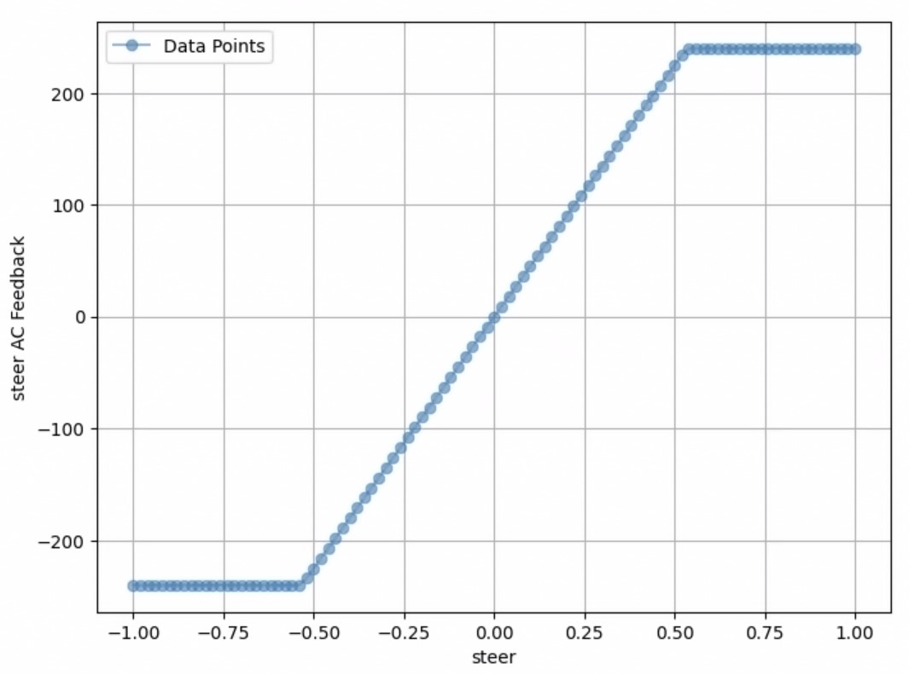

<h1>Assetto Corsa Gym Linux Setup</span></h1>

Instructions on how to run Assetto Corsa on Linux, partially based on this [guide](https://www.youtube.com/watch?v=8qy_RQr8LbM). tested on Ubuntu 24.04.

**IMPORTANT: When training RL agents, use the lowest resolution in Assetto Corsa, lower all graphics settings, and avoid full-screen mode. Close all applications, as network traffic or background applications can cause jitter, especially on slow hardware. Content Manager is useful for creating different profiles.**


## **1. Proton Setup**
To run Assetto Corsa on Linux, we need to first install Proton. 

### **1.1 Enable Assetto Corsa to use Steam Compatibility Tool**
Go to Steam Library > Assetto Corsa

`Manage > Properties > Compatibility > Check 'Force the use of a specific Steam Play compaitbility tool`

After checking the box, you are expected to see a list of available Proton version attached below. 

Next we will install and add a specific Proton version: **GE-Proton9-2**.  

### **1.2 Download ProtonUp-Qt** 
ProtonQT is needed to install GE-Proton-9-2.

🔗 **[Download ProtonUp-Qt](https://davidotek.github.io/protonup-qt/)** 

Mark the AppImage as executable and run ProtonUp-Qt, and double-click to execute the AppImage. 
```sh
chmod +x ProtonUp-Qt*.AppImage
```

### **1.3 Install GE-Proton-9-2 with ProtonUp-Qt**
#### **Step 1: Locate Installation Folder**
Under `Install for:`, ProtonUp-Qt will automatically locate the position of `compatibilitytools.d`. If not, you can manually locate the folder's position or customize the installing position. 

#### **Step 2: Install GE-Proton9-2**
Click `Add version`, choose `GE-Proton` for `Compatibility Tool` and `GE-Proton9-2` for `Version`, and click `Install`.

#### **Step 3: Set GE-Proton9-2 as the Proton version for Assetto Corsa**
Click `Show game list`, choose `GE-Proton9-2` as the compatibility tool, and click `apply`. 

Then reboot Steam, you would expect GE-Proton9-2 to be the default Proton version under `Manage > Compatibility`. If not, you can find GE-Proton9-2 in the list and choose it as the Proton version. 

### **1.4 Initiate Assetto Corsa**
Start Assetto Corsa, and expect to wait about 3 to 5 minutes for Proton to install and initialize.
If the program crashes, start Steam from the command line. The installation details of Proton will be displayed when Assetto Corsa is running. A quick fix for Proton crashes is to switch to a different version.

**Note**: On some systems, the Assetto Corsa main screen worked, but the race would not start. Switching to GE-Proton9-26 resolved the issue.

## **2. Content Manager Installation**
### **2.1 Download Content Manager**
Download and unzip Content Manager.

🔗 [Content Manager Download](https://acstuff.ru/app/)

### **2.2 Create hard link for Content Manager**
We run `Content Manager.exe` by creating a hard link to `AssettoCorsa.exe`, such that Proton will execute the content manager as if it is running Assetto Corsa. 

#### **Step 1: Move the downloaded exe to Assetto Corsa local folder**
1. Locate Assetto Corsa local folder by 

    `Manage > Manage > Browse local files`. 

    The folder will usually be in the form of 
    ```
    <path/to/steamapps>/steamapps/common/assettocorsa
    ```

2. Move the downloaded `Content Manager.exe` to Assetto Corsa local folder location. 

#### **Step 2: Rename AssettoCorsa.exe**
Rename the original `AssettoCorsa.exe` to `AssettoCorsaBackup.exe` to avoid conflict. We will retreive its name later. 

### **2.3 Create a hard link for Content Manager.exe**
```sh
ln Content\ Manager.exe AssettoCorsa.exe
```
You would expect `AssettoCorsa.exe` is generated, and it is linked to `Content Manager.exe`. 

### **2.3.5 (Optional):  Create a soft link for Steam user config**
1. First locate the user config folder in Proton. Naviagate the parent folder (usually `steamapps`) of Assetto Corsa local folder, and locate to 
`~/.local/share/Steam/steamapps/compatdata/244210/pfx/drive_c/Program Files (x86)/Steam/config`. 


2. Then locate the local user config, for example `~/.steam/root/debian-installation/config`
3. Create a softlink to user config folder in Proton, for example

```sh
ln -s "~/.steam/root/debian-installation/config" "/home/<user>/.local/share/Steam/steamapps/compatdata/244210/pfx/drive_c/Program Files (x86)/Steam/config"
```

### **2.4 Initiate Content Manager**
Go to Steam Assetto Corsa page, and start Assetto Corsa. Due to the hard link created, the Content Manager will be initiated rather than the Assetto Corsa game itself. 

In the setting page, for `Assetto Corsa root folder`, set

`\home\<user>\.local\share\Steam\steamapps\common\assettocorsa\`

### **2.5 Install Custom Shader Patch**

1. Download CSP v0.2.1 (other versions have a bug that makes the screen too dark, and the stable version crashes) from [https://acstuff.club/patch/?info=0.2.1](https://acstuff.club/patch/?info=0.2.1).

2. Install it by dragging and dropping the downloaded ZIP file into Content Manager Window.

**WARNING**: if `INIReader::cache error` is reported when running Assetto Corsa game, you need to switch to a upgraded version of custom shader patch (e.g. ver 0.2.7), though the game graphics may be affected. 

### **2.6 Rename back the original AssettoCorsa.exe**
Rename the current `AssettoCorsa.exe` (the content manager) into `AssettoCorsa_content_manager.exe`, and rename `AssettoCorsaBackup.exe` (the "true" AC game) into `AssettoCorsa.exe`.  


## **3. Setup xbox input device**
Linux uses virtual xbox as a substitute for Windows Vjoy to communicate with AC server. 
### **Step 3.1: Install xboxdrv**
```sh
sudo apt-get install xboxdrv
```
### **Step 3.2: Turn on virtual xbox**
```sh
sudo xboxdrv --daemon --silent --mimic-xpad --type xbox360 --dbus disabled
```
### **Step 3.3: Figure out correct device input for virtual xbox**
```sh
ls /dev/input
```
There will be a list of `event<NUM>` with one of them mapped with virtual xbox. 

Locate the input device index number for virtual xbox by searching with
```sh
cat /proc/bus/input/devices
```
### **Step 3.4: Set write permission to device**
```sh
sudo chmod 666 /dev/input/event<NUM>
```
Install `pip  install evdev` in Python and the XBox device will be automatically selected. To debug use the following.

### **Step 3.5 (Optional): Revise Device Axis Codes and Input Ranges in `vjoy_linux.py`**

1. Run `test_maps_creator.ipynb`.  
   You should see an output like:

   ```
   Closest Steering Command to reach 240.0°: 0.5342
   ```

   It will also display a figure showing the input-output mapping in Assetto Corsa:

   

   If the result matches, it means the Xbox controller is properly configured.  
   If not, proceed to the next steps.

2. Install `evtest` and use it to identify the event code of your device:

   ```sh
   sudo apt-get install evtest
   sudo evtest /dev/input/event<NUM>
   ```

3. If needed, update the axis codes (lines 69–79) and input ranges (lines 81–98) in:

   - [`AssettoCorsaEnv/vjoy_linux.py`](./assetto_corsa_gym/AssettoCorsaEnv/vjoy_linux.py)
   - [`AssettoCorsaPlugin/sensors_par/vjoy_linux.py`](./assetto_corsa_gym/AssettoCorsaPlugin/plugins/sensors_par/vjoy_linux.py)

   Also update the **AXLE** settings for `STEER`, `THROTTLE`, and `BRAKES` in [`Vjoy_linux.ini`](./assetto_corsa_gym/AssettoCorsaPlugin/windows-libs/Vjoy_linux.ini) if necessary.

---
## **4. Assetto Corsa game configuration**
### **4.1 Copy the Plugin Files**  
1. Locate the plugin folder in this repository:  
   ```sh
   .\assetto_corsa_gym\AssettoCorsaPlugin\plugins\sensors_par
   ```
2. Copy this folder to the Assetto Corsa installation directory under `apps\python\`.  
   - The default AC installation path is:  
     ```sh
     <path/to/steamapps>\steamapps\common\assettocorsa\
     ```
3. The final destination should look like this:  
   ```sh
   <path/to/steamapps>\steamapps\common\assettocorsa\apps\python\sensor_par
   ```


### **4.2 Install Configuration Files**  
Copy the necessary configuration files from:  
```sh
assetto_corsa_gym\AssettoCorsaPlugin\windows-libs
```

- **VJoy Configuration**  
  - Copy `Vjoy_linux.ini` to:  
    ```sh
    <path/to/steamapps>\steamapps\common\assettocorsa\cfg\controllers\savedsetups
    ```
- **WASD Controls**  
  - Copy `WASD.ini` to:  
    ```sh
    <path/to/steamapps>\steamapps\common\assettocorsa\cfg\controllers\savedsetups
    ```
- **DLLs and Library Folders**  
  - Copy these folders (Python socket library) to:  
    ```sh
    <path/to/steamapps>\steamapps\common\assettocorsa\steamapps\common\assettocorsa\system\x64
    ```


### **4.3 Configuring Assetto Corsa**  


#### **4.3.1: Enable the Plugin**  
1. Open **Assetto Corsa**  
2. Go to **Options > General > UI Modules**  
3. Enable `sensor_par`  

#### **4.3.2 Configure Controls**  
1. Navigate to **Options > Controls**  
2. Ensure that both **vJoy** and **WASD** are available  
3. Load **vJoy** as the active input

#### **4.3.3 Set Video and Display Settings**  
- **Frame Rate Limit:** `50 FPS`  
  - *(Located in `Options > Video > Display > Framerate Limit`)*  

#### **4.3.4 Start a Hotlap Session**  
- **Mode:** `Challenge > Hotlap`  

#### **4.3.5 Adjust Driving Assists**  
| Setting                   | Recommended Value |
|---------------------------|------------------|
| Automatic Gearbox         | **ON** |
| Ideal Racing Line         | **As Preferred** |
| Automatic Clutch          | **Enabled** |
| Automatic Throttle Blip   | **Disabled** |
| Traction Control          | **OFF** |
| Stability Control         | **OFF** |
| Mechanical Damage         | **OFF** |
| Tyre Blankets             | **ON** |
| ABS                       | **OFF** |
| Fuel Consumption          | **OFF** |
| Tyre Wear                 | **OFF** |
| Slipstream Effect         | **1x** |
| Time of Day               | **10:00 AM** |
| Weather                  | **Mid Clear** |
| Ambient Temperature       | **26°C** |
| Time Multiplier           | **1x** |
| Track Surface             | **Optimum** |
| Penalties                 | **ON** |

---
## **5. Run AC Game**
Note: when first launched the game, it is possible that you will be prompted `Failed to lauch the race` due to `Font "C:\windows\Fonts\verdana.ttf" is missing.` 
1. Click "Yes" and you will download `ac-fonts.zip`
2. Extract all `.ttf` files in folder `system` in `ac-fonts.zip`
3. Move all `.ttf` files to 
    ```sh
    <path/to/steamapps>/steamapps/common/assettocorsa/content/fonts/system`
    ```
4. Relaunch the AC game. 
