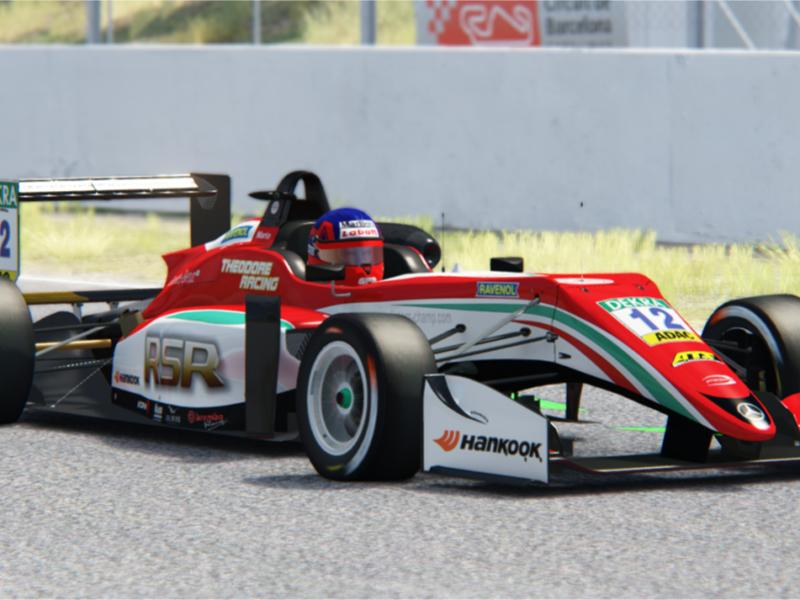
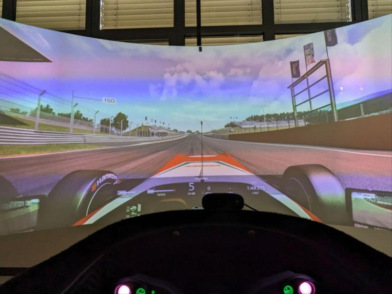
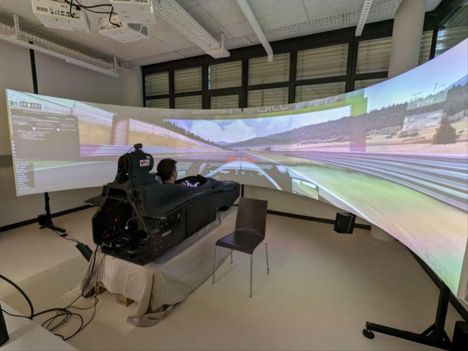
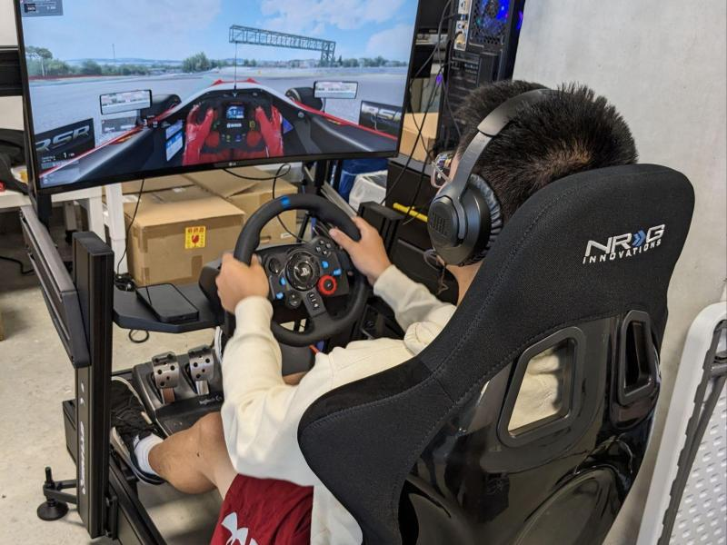
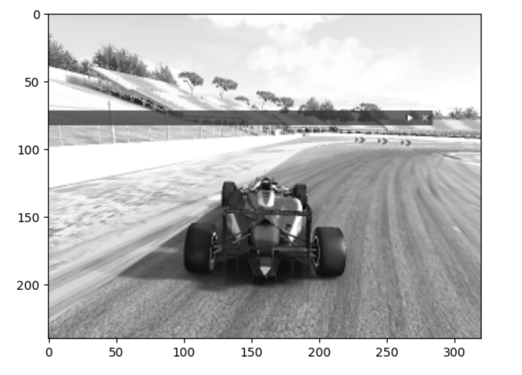
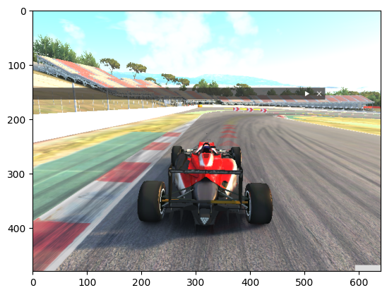

<h1>Assetto Corsa Gym</span></h1>

Official implementation of the paper:
[A Simulation Benchmark for Autonomous Racing with Large-Scale Human Data](https://assetto-corsa-gym.github.io/)




[[Website]](https://assetto-corsa-gym.github.io/)  [[Dataset]](https://huggingface.co/datasets/dasgringuen/assettoCorsaGym) [[ROS2 interface]](https://github.com/ayoubraji/assetto_corsa_ros2) 
 [[Paper]](https://arxiv.org/abs/2407.16680)

----


## 📄 Table of Contents

- [Overview](#overview)
- [Updates](#updates)
- [Source Code Tree](#source-code-tree)
- [Getting Started](#getting-started)
- [Demos](#demos)
- [Benchmarks](#benchmarks)
  - [Example policy for Monza and GT3](#example-policy-for-monza-and-the-gt3-car)
  - [Train SAC from Scratch](#train-from-sac-from-scratch)
  - [Test a Model](#test-a-model-by-loading-a-checkpoint)
  - [Train SAC from Demonstrations](#train-sac-from-demonstrations-using-an-ensemble-of-buffers)
  - [Train with Weights & Biases](#train-with-weights--biases-enabled)
- [Screen Capture Support](#screen-capture-support)
- [Download Datasets](#download-datasets)


## Overview
Gym interfaces with AssettoCorsa for Autonomous Racing. This repository integrates the AssettoCorsa racing simulator with the OpenAI's Gym interface, providing a high-fidelity environment for developing and testing Autonomous Racing algorithms in realistic racing scenarios.


Features:
- High-Fidelity Simulation: Realistic car dynamics and track environments.
- Customizable Scenarios: Various cars, tracks, and weather conditions.
- RL Integration: Compatible with Gym for easy application of RL algorithms.
- [ROS2 interface](https://github.com/ayoubraji/assetto_corsa_ros2)
- Baselines: Soft Actor-Critic ([SAC](https://arxiv.org/abs/1801.01290))(this code base) and TD-MPC2 (to be uploaded soon)

This repository contains all the necessary code to run the Gym interface for Assetto Corsa and RL benchmarks. For the ROS2 interface, refer to [ROS2 interface](https://github.com/ayoubraji/assetto_corsa_ros2)

We base our SAC code on [this](https://github.com/toshikwa/discor.pytorch) implementation.
## **Updates**  

### **Apr 2025:**
- Added support for **running Assetto Corsa and training agents natively on Linux** using **Proton**.  
  The Linux version offers **better execution speed** and is **more stable** than Windows, while yielding **identical results**.  
  - See detailed installation instructions in [INSTALL_Linux.md](INSTALL_Linux.md).
  - Thanks to [@xi-jiajun](https://github.com/xi-jiajun) and [@alfredgu001324](https://github.com/alfredgu001324) for their contributions.
- Added support for **manual gearbox shifting**.


### **Feb 2025: Support for Alternate Python Interpreters**  
- Now supports the use of **newer Python interpreter versions** on the plugin side.  

### **Feb 2025: Screen Capture Support**  
- Added support for retrieving images from the **OpenAI Gym** interface.  
- Images can be saved directly to the hard drive.  
- Implemented a **dual-buffer shared memory mechanism** to minimize read/write latency.  
- Color and gray scale images support.
- See the usage examples and installation instructions below.  

<p align="center">
    
    
</p>


### **Dic 2024: Checkpoints**  
- Added example checkpoints for the **SAC policy** for **Monza** and the **GT3 car**.  


## Source Code Tree:

- **assetto_corsa_gym**
  - **assetto-corsa-autonomous-racing-plugin**
    - Plugin for AC
  - **AssettoCorsaConfigs**
    - **cars**
    - **controls maps**
    - **tracks**
      - Track bounds
      - Occupancy
      - Racing line
  - **AssettoCorsaEnv**
    - Communication client
    - OpenAI Gym interface
- **algorithm**
  - SAC baseline
- **data**
  - Extra information of the dataset and statistics. Instructions to record human demonstrations


## Getting started

1. **Install the AC plug-in**
    Follow the instructions in [`INSTALL.md`](INSTALL.md)


1. **Install Python in Windows**

    - **Install Visual Studio Compiler**
      - To compile the necessary components for the plugin, download and install the Visual Studio compiler from:
      [Visual Studio C++ Build Tools](https://visualstudio.microsoft.com/visual-cpp-build-tools/)
      - Make sure to install the C++ build tools component

    - **Install Python using Anaconda**
      ```
      conda create -n p309 python=3.9.13
      conda activate p309
      pip install setuptools==65.5.0 "cython<3"
      pip install "wheel<0.40.0"
      python -m pip install pip==24.0
      pip install -r requirements.txt
      conda install pytorch==1.12.1 cudatoolkit=11.6 -c pytorch -c conda-forge
      ```

2. **Download the tracks occupancy grid**
    - Get the files from here [tracks](https://huggingface.co/datasets/dasgringuen/assettoCorsaGym/tree/main/AssettoCorsaConfigs/tracks).
    - Optionally, download them using the Huggingface Hub interface:
      - Install it: `conda install -c conda-forge huggingface_hub`
      - And run:
        ```sh
        python -c "from huggingface_hub import snapshot_download; snapshot_download(repo_id='dasgringuen/assettoCorsaGym', repo_type='dataset', local_dir='AssettoCorsaGymDataSet', allow_patterns='AssettoCorsaConfigs/tracks/*')"
        ```
      - Move the pickle files to `assetto_corsa_gym/AssettoCorsaConfigs/tracks`.

    - To create a new track:
      - Each track needs an occupancy grid (pickle), a reference line (can be the one from AC but also something else), and the track bounds. These files are located in `assetto_corsa_gym/AssettoCorsaConfigs/tracks`.
      - The reference line and the occupancy grid are needed to run the Gym interface. 
      - Create the occupancy grid, the reference path and the track bounds:
        - Start Assetto Corsa and set the new track.
        - Run `assetto_corsa_gym/AssettoCorsaConfigs/tracks/generate_track.ipynb` to create a new track. This script creates a pickle file with the occupancy grid, downloads the AC reference path, and visualizes the track. Make sure to update the `assetto_corsa_gym/AssettoCorsaConfigs/tracks/config.yaml` file.


## Demos
- **test_client.ipynb**
  - Demonstrates the use of the Assetto Corsa Sim interface (client) without the OpenAI Gym interface layer.

- **test_gym.ipynb**
  - Demonstrates the use of the Gym interface without an agent.


## Benchmarks
Experiments and parameters are configured via `config.yml` and executed with `python train.py`. Optionally, a different config file can be specified using `python train.py config=<config_file>`. To enable logging to Weights and Biases, appropriate values should be set in the config file. Each parameter in the config file can be modified directly from the terminal using `<field>=<value>`. For instance, to change the car, use `AssettoCorsa.car=<car>`.

  - **Example policy for Monza and the GT3 car**

    The checkpoints are in the dataset (see below). The expected lap time is approximately 112.1 seconds.
    ```
    python train.py --test --load_path <path_to_dataset>\monza\bmw_z4_gt3\20241108_SAC\model\checkpoints\step_05400000 AssettoCorsa.track=monza AssettoCorsa.car=bmw_z4_gt3
    ```

  - **Train from SAC from Scratch**
    - To train SAC from scratch in Barcelona/F317:
      ```
      python train.py
      ```

    - To train on other cars and tracks (ensure the car and track are set first in AC):

      ```
      python train.py AssettoCorsa.track=<track> AssettoCorsa.car=<car>
      ```
      Example for Monza GT3:
      ```
      python train.py AssettoCorsa.track=monza AssettoCorsa.car=bmw_z4_gt3
      ```

- **Test a model by loading a checkpoint**
  ```
  python train.py --test --load_path <path_to_model> AssettoCorsa.track=<track> AssettoCorsa.car=<car>
  ```

- **Train SAC from demonstrations using an ensemble of buffers**
  - Update ac_offline_train_paths.yml (see available data in data\paths.yml).

  - Run:
    ```
    python train.py load_offline_data=True Agent.use_offline_buffer=True dataset_path=<path_to_dataset>
    ```

- **Train with Weights & Biases enabled**  
  ```python
  python train.py disable_wandb=False
  ```


### Screen Capture Support  

#### How to Use:  
1. Complete the required installation steps and dependencies (see [`INSTALL.md`](INSTALL.md)).  

2. Install additional dependencies in your **current environment (Python 3.9+)**:
`pip install pygetwindow opencv-python`
3. Set the resolution in Assetto Corsa to **640x480**.  
4. In `<AC_installation_folder>/apps/python/sensor_par/config.py`, set `screen_capture_enable = True`.  
   - *(See other available options in this file.)*  
5. Enable image support in `config.yml` and ensure the width and height match `sensor_par/config.py`:  `screen_capture_enable: True`

6. **To save images to the hard drive** (tested up to **25Hz**), set `screen_capture_save_to_disk = True` in `sensor_par/config.py`.
The images can be found in `<AC_installation_folder>`.

7. Run `test_gym_images.ipynb`


## Download Datasets

- Currently supported tracks:
  - Barcelona: `ks_barcelona-layout_gp`
  - Monza: `monza`
  - Austria: `ks_red_bull_ring-layout_gp`
  - Oval: `indianapolis_sp`
  - Silverstone: `ks_silverstone-gp`<br><br>


- To download everything at once (120GB):

  ```python
  git clone https://huggingface.co/datasets/dasgringuen/assettoCorsaGym
  # After cloning, delete the .git directory to free up space
  ```

- To download one track and car combination at a time, run the following replacing <track> and <car>:

  ```python
  from huggingface_hub import snapshot_download

  snapshot_download(
      repo_id="dasgringuen/assettoCorsaGym",
      repo_type="dataset",
      local_dir="AssettoCorsaGymDataSet",
      allow_patterns="data_sets/<track>/<car>/*"
  )
  ```


  Hugging Face is currently having some false positives in their dataset checking due to a security issue with pickle files importing numpy:

  ```
    Detected Pickle imports:
    - "numpy.core.multiarray.scalar"
    - "numpy.core.multiarray._reconstruct"
    - "numpy.dtype"
    - "numpy.ndarray"
  ```

  Hugging Face flags these for security reasons. You can see more about this in the issue [here](https://github.com/dasGringuen/assetto_corsa_gym/issues/5). We plan to convert the files to a safer format like Parquet in the future.<br><br>


----

## Contributing

You are very welcome to contribute to this project. Feel free to open an issue or pull request if you have any suggestions or bug reports, but please review our [guidelines](CONTRIBUTING.md) first. Our goal is to build a codebase that can easily be extended to new environments and tasks, and we would love to hear about your experience!

----

## License

This project is licensed under the MIT License - see the `LICENSE` file for details. Note that the repository relies on third-party code, which is subject to their respective licenses.

---
## Acknowledgments

- Adrian Remonda [@dasgringuen](https://github.com/dasgringuen) (TU Graz / UCSD)
- Jiajun Xi [@Nightwalkx](https://github.com/xi-jiajun)
- [@alfredgu001324](https://github.com/alfredgu001324)
- Francesco Gatti (TII EuroRacing - Hipert)
- Andrea Serafini (TII EuroRacing - Unimore)
- Francesco Moretti (TII EuroRacing - Unimore)
- Ayoub Raji (TII EuroRacing - Unimore)
